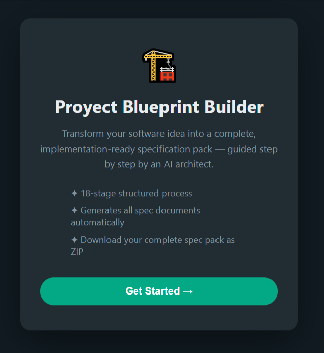
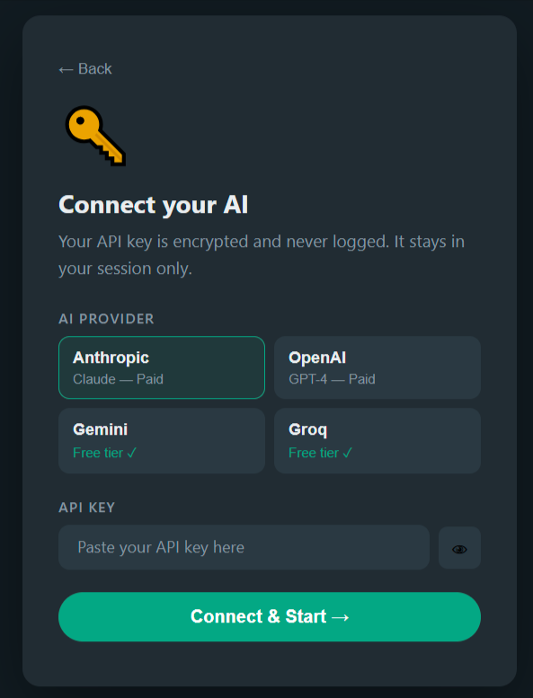
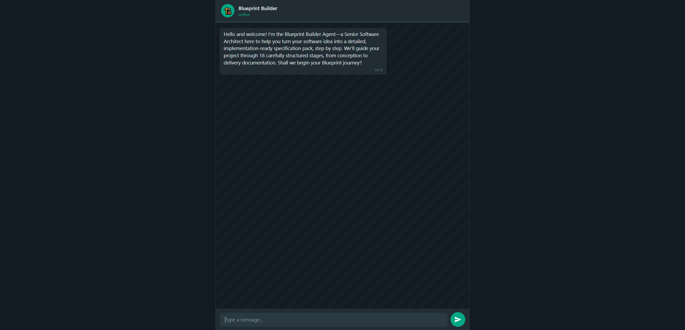
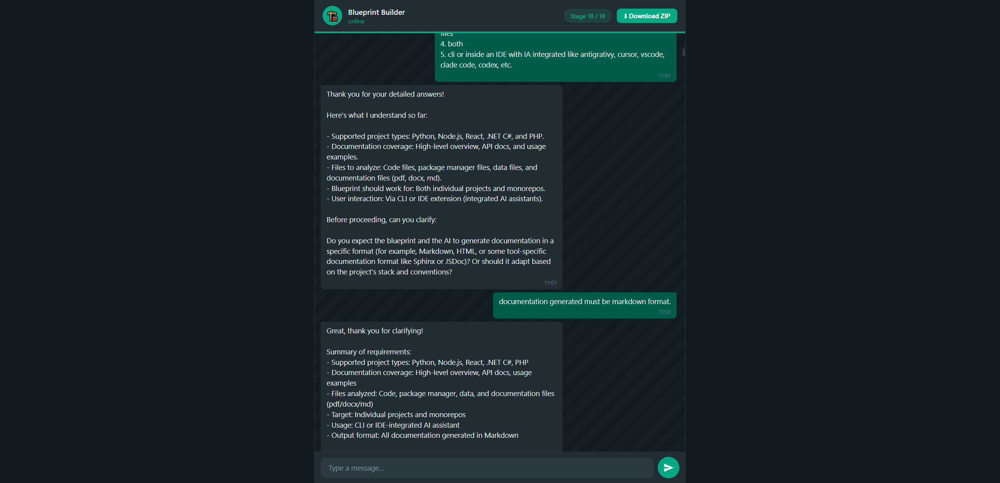

# 🏗️ Proyect Blueprint Builder — Web Chat

A WhatsApp-style chat interface that guides you through 18 stages to generate a complete, implementation-ready software specification pack.

No IDE required. The user brings their own AI API key — nothing is stored on the server in plain text.

---

## Visual Walkthrough







---

## Quick Start

```bash
# 1. Clone
git clone https://github.com/odonline/ai-proyect-blueprint-builder-web-chat
cd ai-proyect-blueprint-builder-web-chat

# 2. Install
pnpm install

# 3. Configure
cp .env.example .env
# Edit .env — set ENCRYPTION_KEY, DB_TYPE, and optionally Redis config

# 4. Generate your ENCRYPTION_KEY
node -e "console.log(require('crypto').randomBytes(32).toString('hex'))"
# Paste the output into ENCRYPTION_KEY in your .env

# 5. Start (SQLite — no extra services needed)
pnpm start
# → http://localhost:3000

# Or with Redis
docker run -d -p 6379:6379 redis:7-alpine
DB_TYPE=redis
```

---

## Configuration (`.env`)

```env
# ── Database ──────────────────────────────────────────────
DB_TYPE=sqlite                 # sqlite | redis

# SQLite — DB file auto-created at data/sessions.db (no extra config)

# Redis — only used when DB_TYPE=redis
REDIS_URL=redis://localhost:6379
# Or individually:
# REDIS_HOST=localhost
# REDIS_PORT=6379
# REDIS_PASSWORD=
# REDIS_DB=0
# REDIS_TLS=false

# TTLs (seconds)
REDIS_TTL_SESSION=604800       # 7 days — chat + session metadata
REDIS_TTL_FILES=172800         # 2 days — generated spec documents

# ── Security ───────────────────────────────────────────────
# AES-256-GCM key for encrypting user API keys at rest
# Generate: node -e "console.log(require('crypto').randomBytes(32).toString('hex'))"
ENCRYPTION_KEY=<64-char-hex>

# ── App ────────────────────────────────────────────────────
PORT=3000
SESSION_SECRET=change-this-to-a-long-random-string
```

> **Note:** The app has no `AI_PROVIDER` or `AI_API_KEY` in `.env` — users supply their own key through the UI.

---

## Supported AI Providers

| Provider | Free Tier | Get Key |
|---|---|---|
| **Gemini** | ✅ No credit card | [aistudio.google.com](https://aistudio.google.com/apikey) |
| **Groq** | ✅ No credit card | [console.groq.com](https://console.groq.com) |
| **Anthropic** | ❌ Paid | [console.anthropic.com](https://console.anthropic.com) |
| **OpenAI** | ❌ Paid | [platform.openai.com](https://platform.openai.com) |

---

## How the API Key Flow Works

```
User enters provider + key in setup screen
          ↓
POST /api/chat/session  { provider, apiKey }
          ↓
Server encrypts key (AES-256-GCM) → stores in DB
          ↓
Browser clears input field immediately
          ↓
Each /api/chat/:id request → server decrypts key → calls AI provider
          ↓
Key never returned to client, never logged
```

---

## Storage Backends

### SQLite (default)
- Zero setup — DB file created at `data/sessions.db` on first run
- GC runs every hour via `setInterval` — expired sessions deleted automatically
- Best for: local use, single-server deployments

### Redis
- Set `DB_TYPE=redis` and provide `REDIS_URL`
- TTL-based expiry is native — no GC process needed
- Two keys per session with independent TTLs:
  ```
  session:{id}          →  messages + metadata   TTL 7 days
  session:{id}:files    →  generated documents   TTL 2 days
  ```
- TTLs reset on every interaction (sliding expiry)
- Best for: multi-server, managed hosting (Upstash, Railway, Redis Cloud)

### Managed Redis (free tiers)

| Provider | Free | Notes |
|---|---|---|
| Upstash | 10k cmd/day | `REDIS_URL=rediss://...` (TLS) |
| Railway | $5 credit/mo | Standard URL |
| Redis Cloud | 30MB free | Standard URL |

---

## Project Structure

```
blueprint-web/
│
├── server.js                          # Express entry point
├── package.json                       # pnpm + dependencies
├── .env.example                       # Config template
├── .gitignore
│
├── BLUEPRINT_BUILDER_AGENT.md         # 18-stage agent instructions (read at runtime)
├── SPEC_AUDITOR_AGENT.md              # Spec validation rules (read at runtime)
│
├── src/
│   ├── ai/
│   │   ├── client.js                  # Multi-provider streaming client
│   │   │                              #   Anthropic · OpenAI · Gemini · Groq
│   │   └── systemPrompt.js            # Builds stage-specific system prompts
│   │
│   ├── blueprint/
│   │   ├── stages.js                  # Stage definitions, parses BLUEPRINT_BUILDER_AGENT.md
│   │   └── sessionManager.js          # Session CRUD + TTL management (DB-agnostic)
│   │
│   ├── db/
│   │   ├── index.js                   # Factory — reads DB_TYPE, returns adapter
│   │   └── adapters/
│   │       ├── redis.js               # ioredis adapter
│   │       └── sqlite.js              # better-sqlite3 adapter (sessions.db / sessions table)
│   │
│   ├── routes/
│   │   ├── index.js                   # GET  /
│   │   ├── chat.js                    # POST /api/chat/session
│   │   │                              # GET  /api/chat/session/:id
│   │   │                              # POST /api/chat/:sessionId  (SSE streaming)
│   │   └── download.js                # GET  /api/download/:sessionId  (ZIP export)
│   │
│   └── utils/
│       └── crypto.js                  # AES-256-GCM encrypt/decrypt for API keys
│
├── views/
│   ├── index.ejs                      # Landing + setup + chat (single page, 3 screens)
│   └── partials/                      # Available for EJS components
│
├── public/
│   ├── css/
│   │   └── style.css                  # WhatsApp dark theme
│   └── js/
│       └── chat.js                    # Frontend: setup flow + SSE consumer + UI
│
└── data/                              # Auto-created, gitignored
    └── sessions.db                    # SQLite DB (only when DB_TYPE=sqlite)
```

---

## UI Flow (3 screens)

```
Landing                Setup                  Chat
────────               ──────                 ────
[Get Started →]  →     Select provider        [WhatsApp-style chat]
                       Paste API key          Stage progress bar
                       [Connect & Start →]    Download ZIP (on completion)
```

---

## Key Design Decisions

**Users supply their own API key** — the server has no AI credentials. Keys are AES-256-GCM encrypted before storage and decrypted only at request time, server-side.

**Backend controls the stage** — the AI calls `complete_stage()` as a tool; the backend increments the counter. The AI cannot skip or jump stages on its own.

**Tool use for file generation** — files are created via a `generate_file(filename, content)` tool call, not by parsing AI text output. This is reliable across all four providers.

**Adapter pattern for storage** — `sessionManager` calls a generic `get/set/ttl/del` interface. Switching between SQLite and Redis is a single `.env` change.

**SSE streaming** — AI tokens stream to the browser in real time. Tool call side-effects (file generation, stage advancement) emit structured SSE events alongside the text stream.